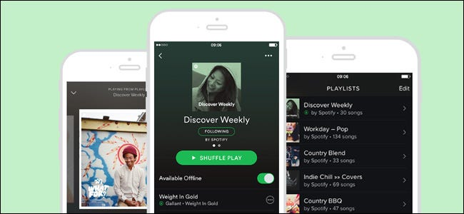

# 音乐推荐系统

像 Spotify 这样的音乐流媒体服务会定期为其数百万用户提供精心策划的音乐推荐，以保持用户持续使用的兴趣。这些推荐必须真正引起用户共鸣，同时还要引入新颖的内容来保持用户的好奇心。

本示例使用数学优化创建音乐推荐。解决方案包含一组用户喜欢且多样化的艺术家，专门针对音乐流媒体平台的用户。通过协同过滤（使用矩阵分解）学习用户偏好，并使用整数规划优化艺术家选择。该示例展示了预测模型如何与指导性模型相结合，创建针对用户喜好进行微调的推荐。

这是一个入门级的建模教程，我们假设您了解 Python 并具有使用定量方法的学科背景。

您可能会发现参考 [Gurobi Python API](https://www.gurobi.com/documentation/current/refman/py_python_api_overview.html) 的文档会有所帮助。
我们的数据科学和数学优化网络研讨会中详细解释了这个笔记本。您可以点击[这里](https://www.youtube.com/watch?v=AJRP9pPBx6s)观看这些视频。

## 查看笔记本

[Google Colab 链接](https://colab.research.google.com/github/Gurobi/modeling-examples/blob/master/music_recommendation/music_recommendation.ipynb)

----
有关许可或运行笔记本的详细信息，请参阅[建模示例](../)概述

© Gurobi Optimization, LLC