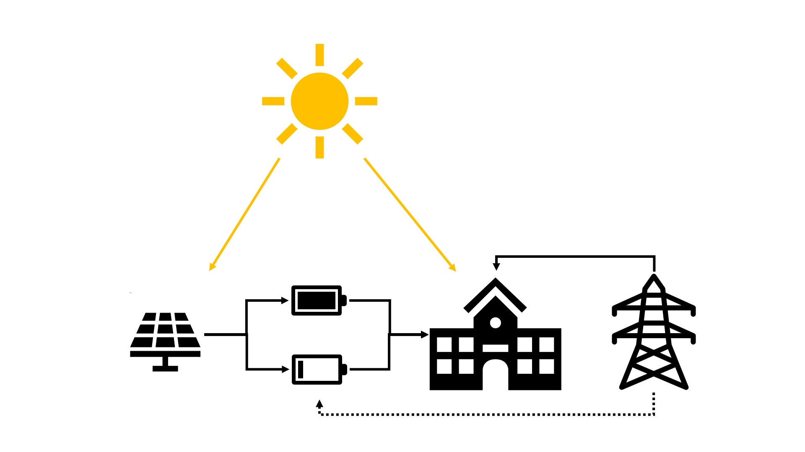

# 建模课程 2 - 可再生能源和储能优化

## 问题
一座大学建筑将在一周内举行课程，这需要电力支持，而且由于课程负荷的变化，电力需求也会发生变化。该建筑配有太阳能电池板提供能源和两个可以存储能源的电池。此外，电力也可以从电网购买。该问题的目标是找到电池充放电计划，以便：
1. 最小化从电网购买的总电量。
2. 根据每个时段的电价，最小化从电网购买电力的总成本。

除了建模示例外，还提供了一个练习。

## 注意剧透！
我们还在仓库中放置了建模1笔记本和练习的**完整**版本。如果您想在没有填写所有内容的情况下完成这些笔记本，请确保不要打开完整版本。

## 查看笔记本

[Google Colab 链接 - 建模课程*不含*答案](https://colab.research.google.com/github/Gurobi/modeling-examples/blob/master/optimization101/Modeling_Session_2/modeling2.ipynb)

[Google Colab 链接 - 练习*不含*答案](https://colab.research.google.com/github/Gurobi/modeling-examples/blob/master/optimization101/Modeling_Session_2/Exercise_Set2.ipynb)

[Google Colab 链接 - 建模课程*含*答案](https://colab.research.google.com/github/Gurobi/modeling-examples/blob/master/optimization101/Modeling_Session_2/completed_modeling2.ipynb)

[Google Colab 链接 - 练习*含*答案](https://colab.research.google.com/github/Gurobi/modeling-examples/blob/master/optimization101/Modeling_Session_2/completed_Exercise_Set2.ipynb)

----
有关许可证详情或如何运行笔记本的信息，请参阅[建模示例](../../)概述

